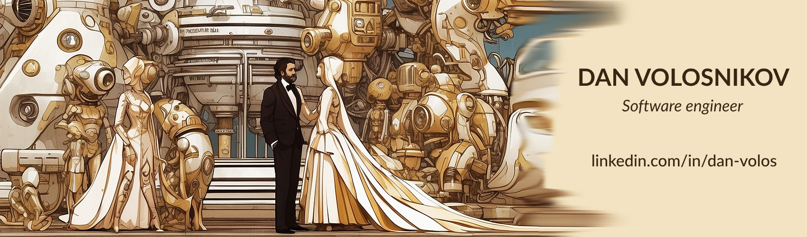

## Professional Summary

Hello, creating applications for me is an art. I am well-versed in various front-end frameworks and libraries, such as Vue, Svelte, and React, and have experience integrating them with back-end technologies Node.js, Java (SpringBoot) and SQL. I am committed to delivering high-quality work that exceeds client expectations.

### Check out my website: [dan-volos.com](https://portroyal.onrender.com/)

### Tech Stack
                   

### About Me
- :walking_man: I enjoy long-distance walking
- :airplane: I love to travel and experience new cultures
- :game_die: I like to play board games, especially chess
- :man_cook: I prefer to cook my own food
- :male_detective: My favorite genre of films is art house or noir detective
- :clap: I appreciate people with outstanding talents
- :musical_keyboard: My musical preferences are post rock, drum and bass, folk and salsa

#### Now Playing:
<!--

-->

### Certifications
- Lambda School Full Stack Web Development
- Meta’s Advanced React
- Meta’s Principles of UX/UI Design
- Python ZTM
- Front End Masters
- Treehouse
- LaunchCode
- FreeCodeCamp
- Codecademy

<i><b>Last Updated on</b></i>&nbsp;<!-- LAST-UPDATE:START -->
Sat 24 Feb 2024
<!-- LAST-UPDATE:END -->
